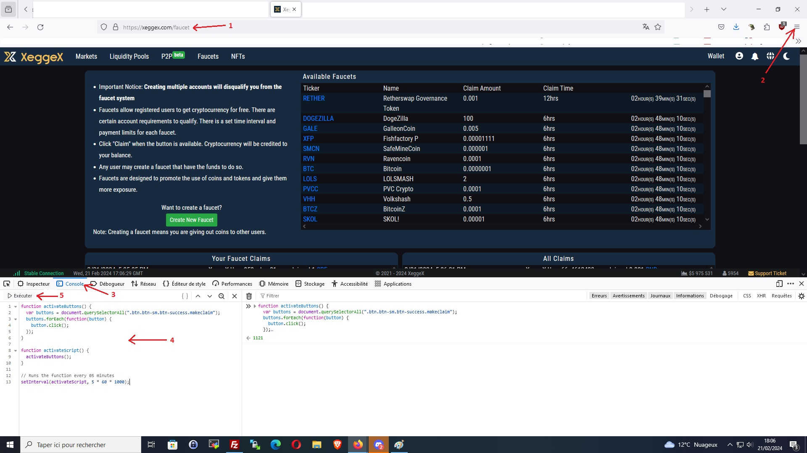

## Description

The script allows you to claim Faucet from the XeggeX exchange It automatically executes the function every 05 minutes.

## Installation

1. Open the XeggeX Faucet page : https://xeggex.com/faucet
2. To use developer mode in Firefox: Menu ➤ Additional tools ➤ Web development tools or "CTRL"+"SHIFT"+"I"
3. Open Console tab
4. Paste the script
5. Click and run

## JavaScript Code

Paste the script on Console tab :

```javascript
function activateButtons() {
  var buttons = document.querySelectorAll(".btn.btn-sm.btn-success.makeclaim");
  buttons.forEach(function(button) {
    button.click();
  });
}

function activateScript() {
  activateButtons();
}

// Runs the function every 05 minutes
setInterval(activateScript, 5 * 60 * 1000); 
```
## Image


